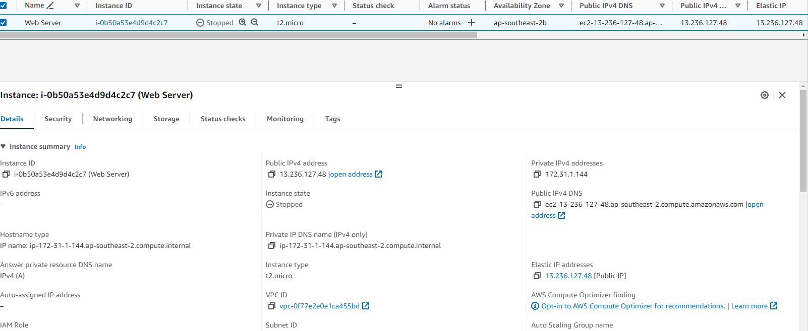
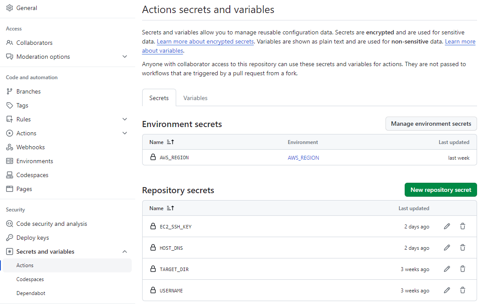
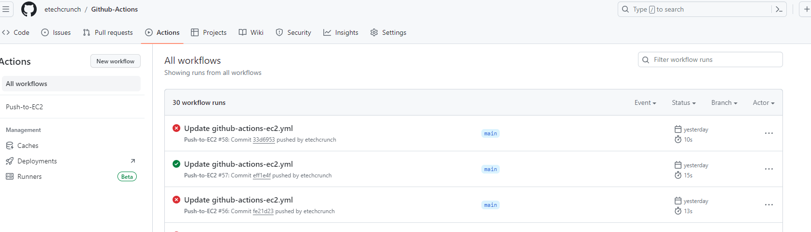
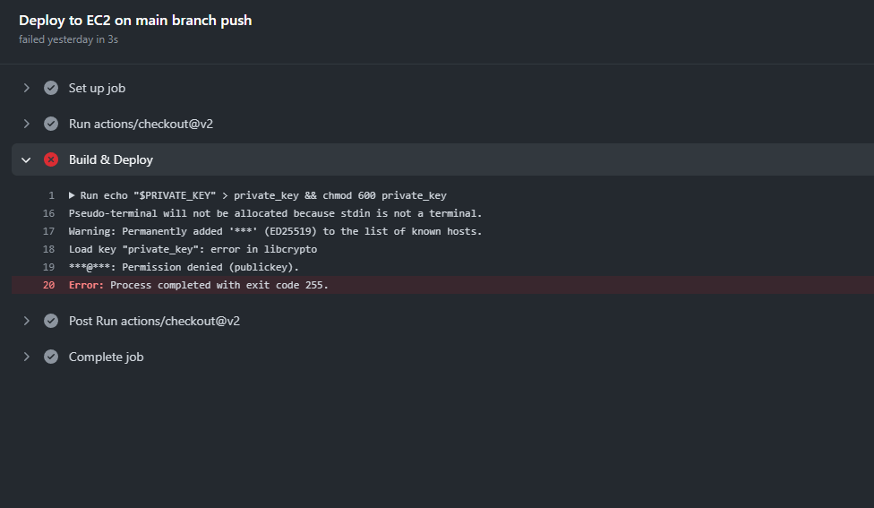

**GITHUB ACTIONS**

In this example a CI/CD pipeline through Github Actions has been created and deployed on EC2 instance on Amazon Web Services

**Step1 (EC2 instance)**

Create an EC2 instance on Amazon Web services. Here I have created Ubuntu instance

With Public IP : 13.236.127.48

DNS : ec2-13-236-127-48.ap-southeast-2.compute.amazonaws.com

Elastic IP: 13.236.127.48




**Step 2 (Displaying HTML page on EC2 instance via Git Hub Action CI/CD Pipeline)**

I have created a simple HTML file with following code

```
<!DOCTYPE html>
<html>
<head>
	<title>Resume</title>
	<link rel="stylesheet" type="text/css" href="style.css">
</head>
<body>
	<div class="container">
		<header>
			<h1>Resume - Muhammad Qasim</h1>
			<p>Web Developer</p>
		</header>
		<section>
			<h2>Summary</h2>
			<p>A highly motivated web developer with 5+ years of experience creating dynamic and responsive web applications. Strong skills in HTML, CSS, and JavaScript, with a passion for creating visually appealing and user-friendly interfaces. Committed to staying up-to-date with the latest trends and technologies in the industry.</p>
		</section>
		<section>
			<h2>Skills</h2>
			<ul>
				<li>HTML</li>
				<li>CSS</li>
				<li>JavaScript</li>
				<li>jQuery</li>
				<li>Bootstrap</li>
				<li>React</li>
			</ul>
		</section>
		<section>
			<h2>Experience</h2>
			<h3>Web Developer, XYZ Company</h3>
			<p>Developed and maintained multiple company websites using HTML, CSS, and JavaScript. Collaborated with designers and project managers to create visually appealing and user-friendly interfaces. Conducted regular code reviews to ensure high-quality and efficient code. </p>
			<h3>Web Developer, ABC Agency</h3>
			<p>Designed and implemented custom WordPress themes and plugins. Worked closely with clients to gather requirements and provide technical support. Conducted regular testing and debugging to ensure optimal performance.</p>
		</section>
		<section>
			<h2>Education</h2>
			<h3>Bachelor of Science in Computer Science</h3>
			<p>University of ABC, Graduated May 20XX</p>
		</section>
		<section id="projects">
			<h2>Projects</h2>
			<p>Some text about your projects...</p>
		</section>
	</div>
</body>
</html>
```

The html code will display following web page that will be published on Apache server on Ubuntu Ec2 instance on AWS through a yaml file

****

In a github/workflow directory create a github-actions-ec2 yaml file

```
name: Push-to-EC2
# Trigger deployment only on push to main branch
on:
  push:
    branches:
      - main
jobs:
  deploy:
    name: Deploy to EC2 on main branch push
    runs-on: ubuntu-latest
    #runs-on: ubuntu-20.04
    steps:
      - uses: actions/checkout@v2
      - name: Build & Deploy
        env:
           PRIVATE_KEY: ${{ secrets.EC2_SSH_KEY }}
           HOSTNAME: ${{ secrets.HOST_DNS }}
           USER_NAME: ${{ secrets.USERNAME }}
           TARGET: ${{ secrets.TARGET_DIR }}                 
    
        run: |
           echo "$PRIVATE_KEY" > private_key && chmod 600 private_key
           ssh -o StrictHostKeyChecking=no -i private_key ${USER_NAME}@${HOSTNAME} 
              #sudo apt-get -y update
              #sudo apt-get install -y apache2
              #sudo systemctl start apache2
              #sudo systemctl enable apache2
              #cd home
              #sudo mv * /var/www/html
```

Store the PRIVATE_KEY, HOSTNAME (The DNS or IP of Ec2 instance), USER_NAME (In our case its Ubuntu) and TARGET (The target directory) in settings\>\>secrets actions.



In Github actions check the workflow deployment




